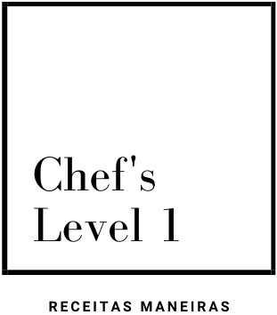
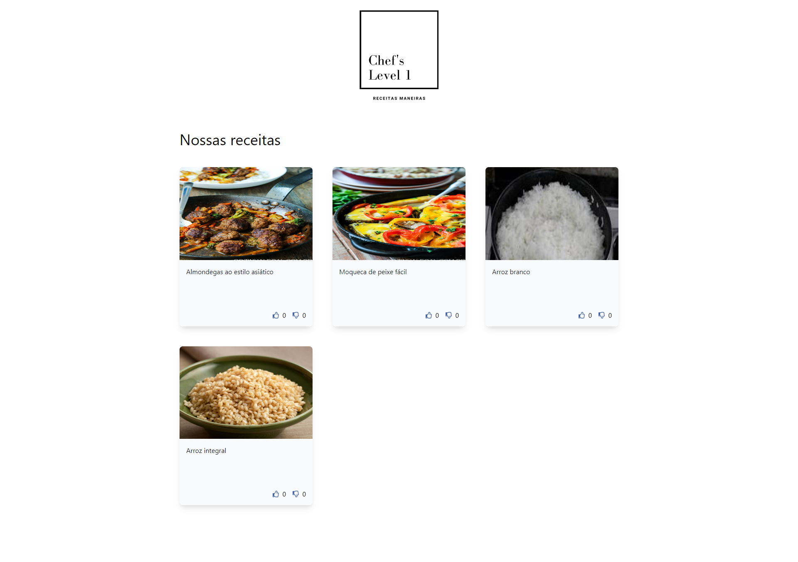
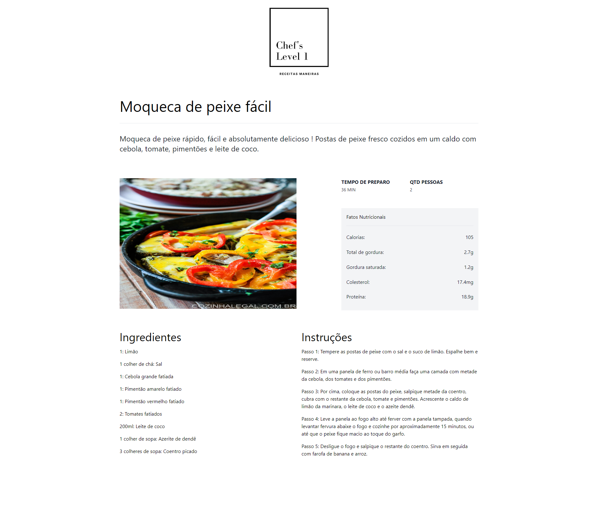

<!-- PROJECT LOGO -->
<!-- markdownlint-disable -->
<div align="center" style="margin-top: 24px">
  
  <h3 align="center">A end-to-end application to train React, Tailwind CSS, JsDoc, PostgreSQL, Node.js and others.</h3>
</div>
<!-- markdownlint-disable -->

<!-- LAYOUT PREVIEW -->
## LAYOUT

### Home



### Details



<!-- GETTING STARTED -->
## Getting Started

This is an example of how you may give instructions on setting up your project locally.

### Installation

1. Clone the repo

   ```shell
   git clone git@github.com:allanfoppa/chefs-level-one.git
   ```

2. Run a Docker command

   ```shell
   docker-compose up
   ```

## Next steps

- [ ] Spotlight recipes on carousel
- [ ] Thumbs logic
- [ ] More content button on home list
- [ ] Share recipe on detail

## FINAL CONSIDERATIONS

This application is a practice project built to explore technologies and concepts. It's not intended for commercial use and may not adhere to best practices for production environments.
Feel free to explore, contribute, or provide feedback. Thank you for checking it out!
